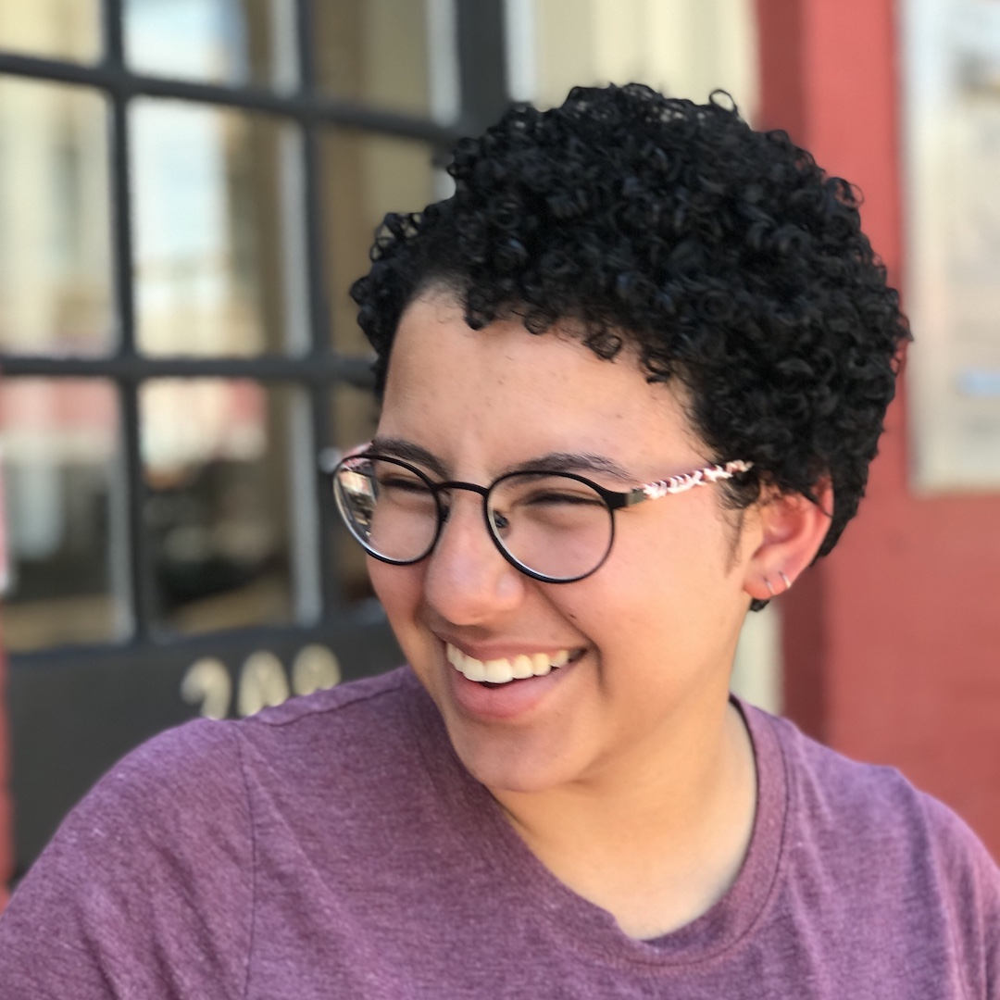

# Amanda Michel: Wicked Problems

 

## Bio

Hi! I'm from Springfield, VA, and I intend to major in Computer Science. Academically, my interests are most anything STEM-related, with an emphasis on technology and math. In my free time, I like to cook, read, and debate about Star Wars. 

## Project Index
[Project One](project1.md) 

## Reflection Index
[Reflection One](reflection1.md): Passive Data Collection in Medicine 

## Individual Assignment Index
Aug 24, 2020: [Getting Started with RStudio: Line Plot](lineplot.md) 
Aug 26, 2020: [Getting Started with RStudio: A More Complicated Plot](complexplot.md) 
Aug 28, 2020: [Data Management Basics](datamanag.md) 
Sep 04, 2020: [Project 1, Part 1](p1part1.md) 
