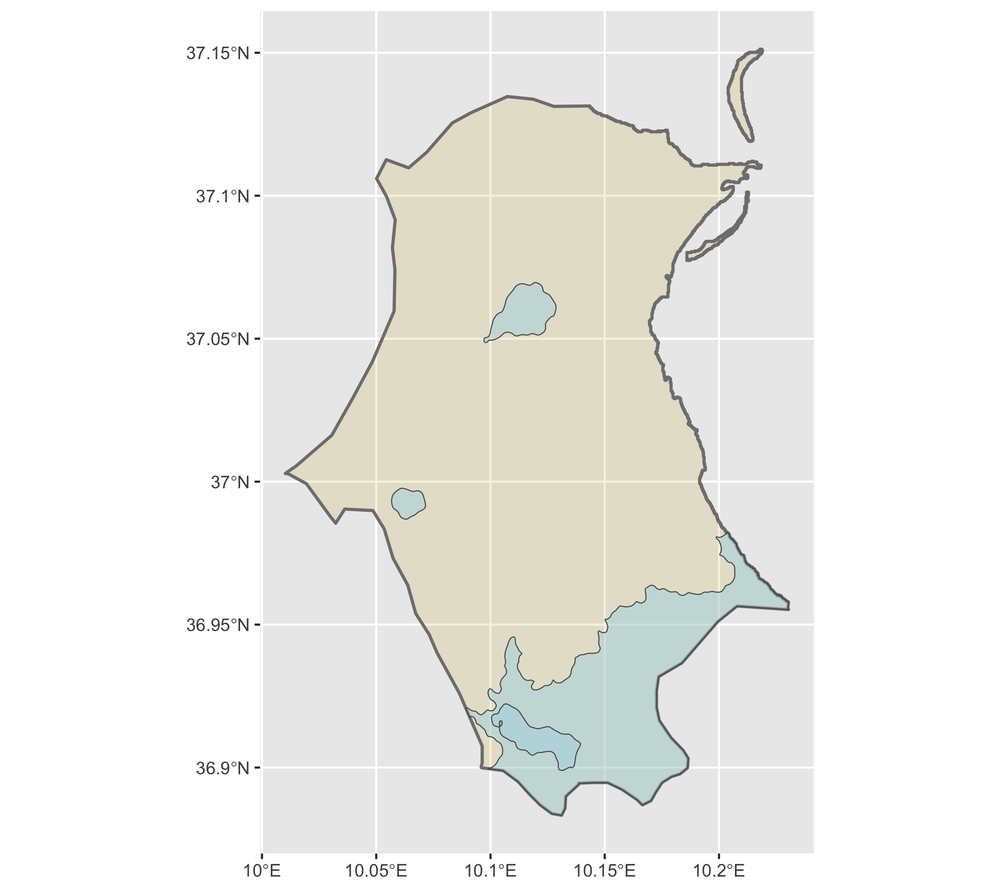

# Accessibility One: De Facto Description of Human Settlements and Urban Areas
The following map considers two combined delegations within the governorate Ariana: Kalaat El Andalous and Raoued. Located near the northern border of Tunisia, these combined delegations have a joint population of 156,058.  

## Team Challenge Question
In this map, we see the population is largely concentrated in the southern region. The de facto boundary here happens to mimic the existing political boundary between Kalaat El Andalous and Raoued. That is, the population is largely concentrated in Raoued, which is further south and very close to a city and water body.  
 
