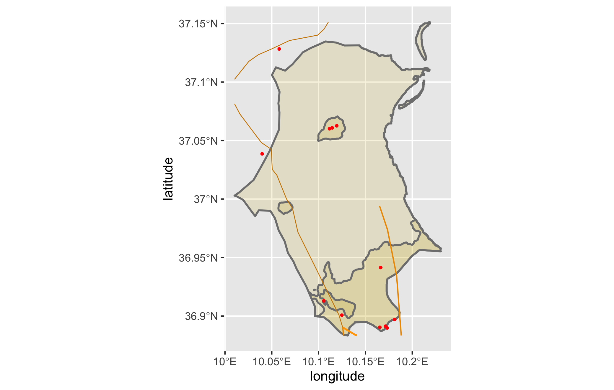

# Accessibility Two: Adding Transportation Facilities & Health Care Services
The following map builds upon the one developed in Accessibility One. As our title suggests, on top of our previous map, we will be adding transportation facilities and health care services.  

## Individual Deliverable
Here, we see four distinct de facto boundaries, with cumulative population of all Kalaat El Andalous and Raoued of 156,058 people (1). The population and density distributions of these settlements actually directly correlate; that is, the most densely populated areas also have the highest raw number of people (the southernmost, larger boundaries). The converse is also true, i.e. the small boundaries futher north also have smaller densities and smaller raw population values (2). The small, thickest road is a primary road; the medium thickness is a privately owned road; and the darkest, thinnest roads are tertiary (3). The only available health care facilities in Kalaat El Andalous and Raoued are pharmacies, indicated by the small, red dots. They are found most densely in our densest population area. Other health care facilities are more populous in the neighboring delegation, which we can see the connection to via primary and private roads (4).  
 

