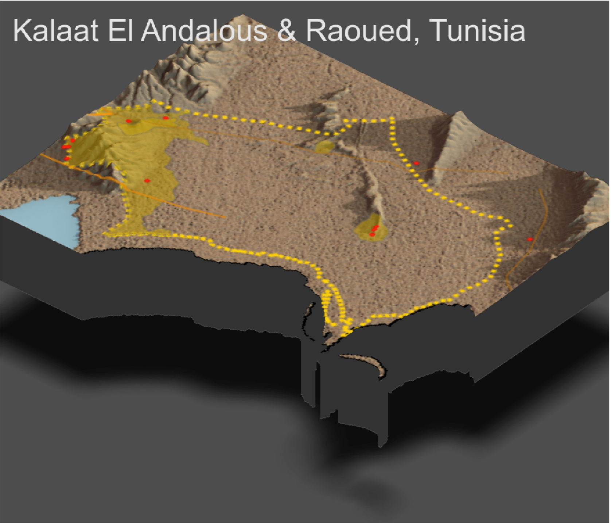

# Accessibility Three: Rendering Topography
The following map takes our previously developed map (Accessibility Two) and overlays it atop a 3D, topographical representation of Kalaat El Andalous and Raoued.  

## Individual Deliverable
All of the de facto settlements are found alongside variants in the terrain, i.e. they are not in the flattest desert areas. The higher density populations are also nearer to water (1). The roads tend to avoid running through the inclined portions of the topography. That is, the roads connect the settlements found in the inclines by running *through* the flat areas (2). Like the de facto settlements, almost all of the health care centers are found along inclines in the terrain (3). The terrain explains *why* the population is concentrated in the south; we knew before that the more urban delegations of Ariana are almost directly southeast of Kalaat El Andalous and Raoued. Now, we can supplement that knowledge by noting the nearness of a water body and distinction from flat desert terrain (4).  
 
