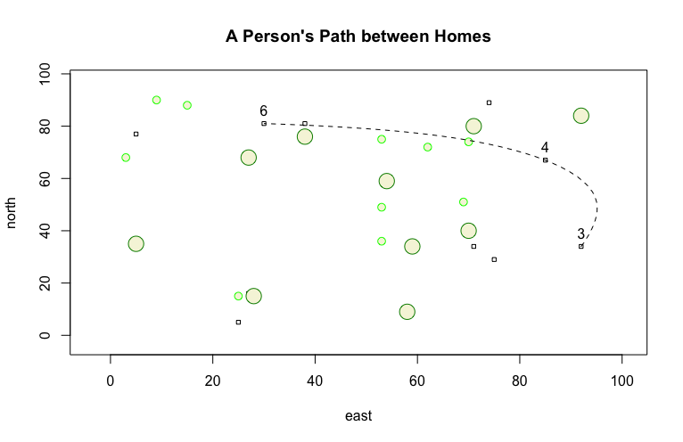

# Getting Started with RStudio: A More Complicated Plot + Challenge

## A More Complicated Plot

My variables x and y each have a range of 1 to 100. The boxes represent 10 dwellings whose locations were established randomly. I also created 20 trees at random locations, represented by the circles: 10 big and 10 small. Three random dwellings were chosen and labeled; the path between them was added to the plot, represented by the dotted line.

## Challenge Question Plot

In this plot, both x and y have a range of 1 to 1000. Similar to the above plot, the boxes represent 50 dwellings with randomly generated coordinates. Again, the circles represent trees, only this time there are 40 small trees and 12 big trees. At random, seven dwellings were selected and labeled and the path between them added as a dotted line.
