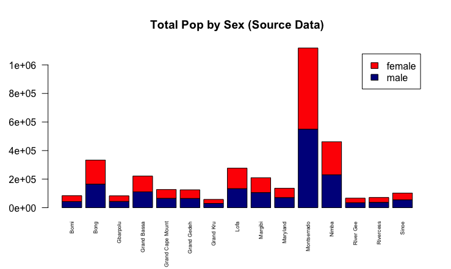
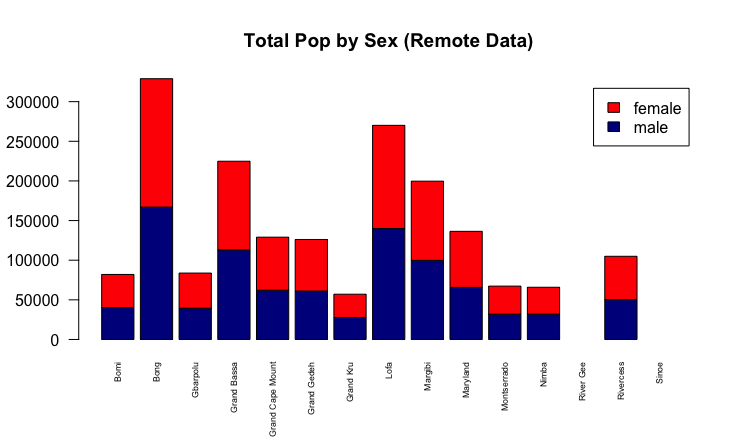
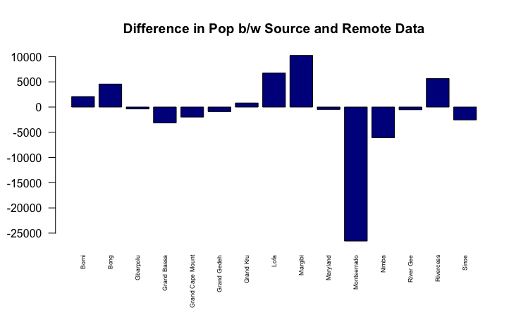
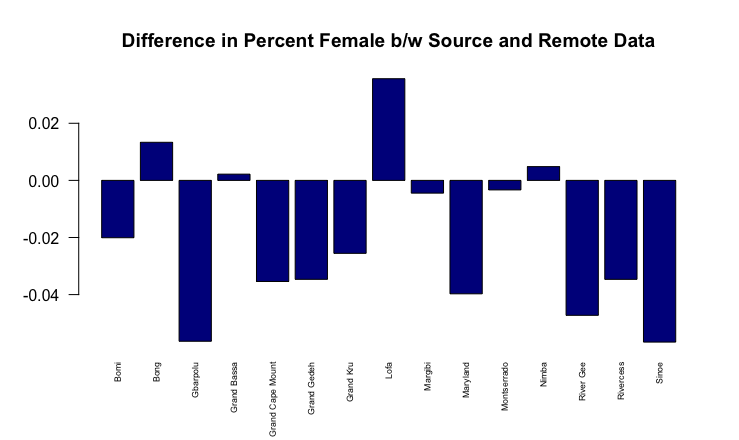
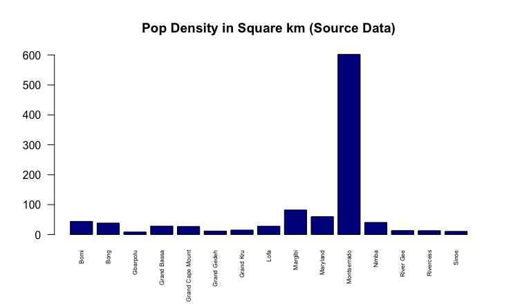

# Data Management Basics

Below is a series of bar plots representing various specificities of Liberia's population by county. Along the y axis is number of people, and along the x axis are the names of the counties. "Source Data" is data collected locally by Liberia, while "Remote Data" is data colleted by the U.S.

## The Plots

 
(Positive values correlate with higher source data values, while negative values correlate with higher remote data values.)

 
(This plot is the exception to the specifications of the y axis above. Instead, the y axis shows number of people per square kilometer of land.)
