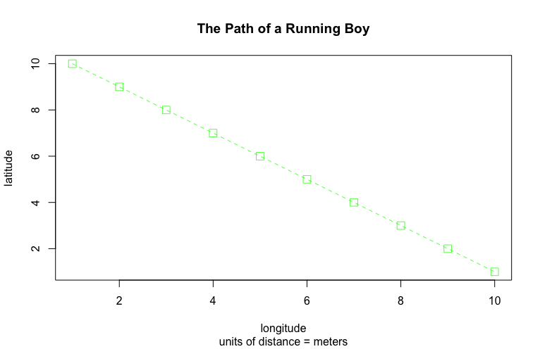

# Getting Started with R Studio: Line Plot

## Line Plot

My two variables, x and y, were assigned the ranges 1 to 10 and 10 to 1, respectively. I plotted their points using the "plot(...)" command.
