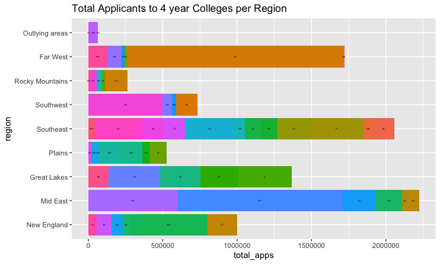
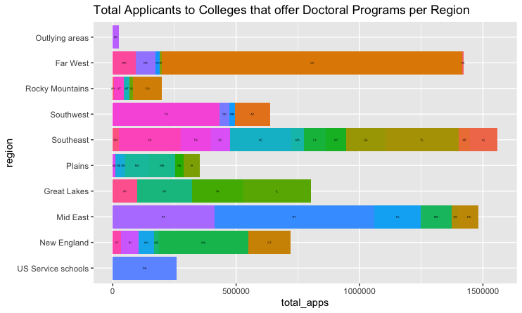
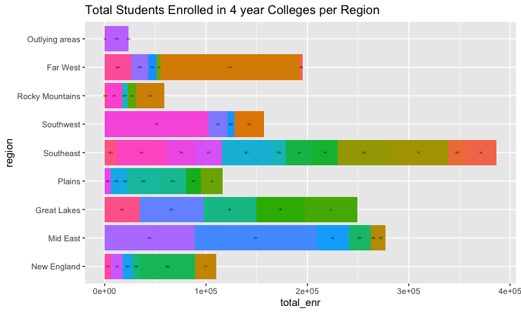
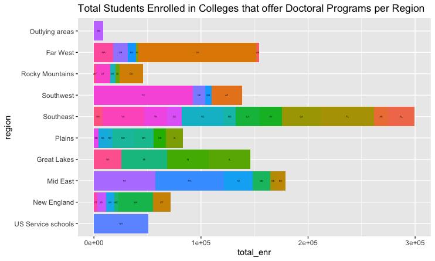

# Project One, Part One: Data Management Basics - Merging, Categorizing, and the Grammar of Graphics
The following four plots consider how many individuals applied to or eventually enrolled in U.S. universities by region. Within the regions, the bars are split up by state, and labelled as such. The first of each pair considers either applicants or enrolled students at four-year universities, while the second of each pair considers those same variables at universities that offer doctoral programs. All the data was collected from the National Center for Education Statistic (NCES) from 2015.

## Deliverables: Total Applicants
 
 

## Stretch Goal: Total Enrolled
 
 
