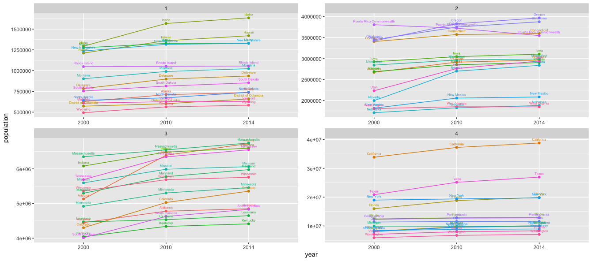

# Project One, Part Two: Data Management Fundamentals - Application Program Interfaces & Tidying up your Data
The following plot considers U.S. Census data collected in 2000, 2010, and 2014. The plot shows the population of individual states (as well as D.C. and Puerto Rico) as a function of the year. Each state gets its own line, and the plot is split up into four quadrants, based on the range of population, to improve readability.

## Deliverable

