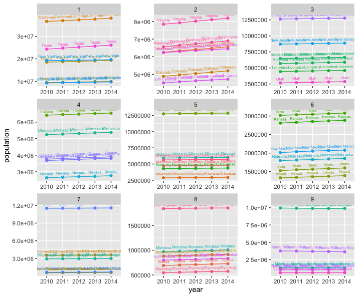
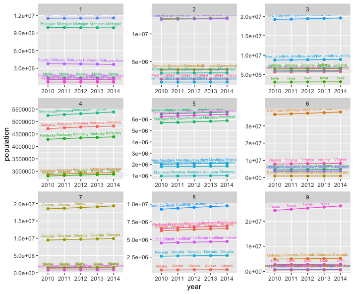

# Project Two, Part One: Data Management Fundamentals - Independently Accessing an API & Creating your Own Plots
The following plot considers U.S. survey data collected from 2010 to 2014. The plots shows the population of individual states (as well as D.C. and Puerto Rico) as a function of the year. Each state gets its own line, and the plots are split up into nine sections to improve readability.  

## Deliverables
The following plot is split into nine sections by total population differences from 2010 to 2014. In other words, the only qualifier as to how this plot is split is the total difference in population from 2010 to 2014.
 
This plot is split by average annual growth rate. The average growth rate taken is calculated by first calculating the annual growth rates individually from 2010 to 2011, then 2011 to 2012, and so on. These four rates are averaged together, and through that average is this plot split up.

