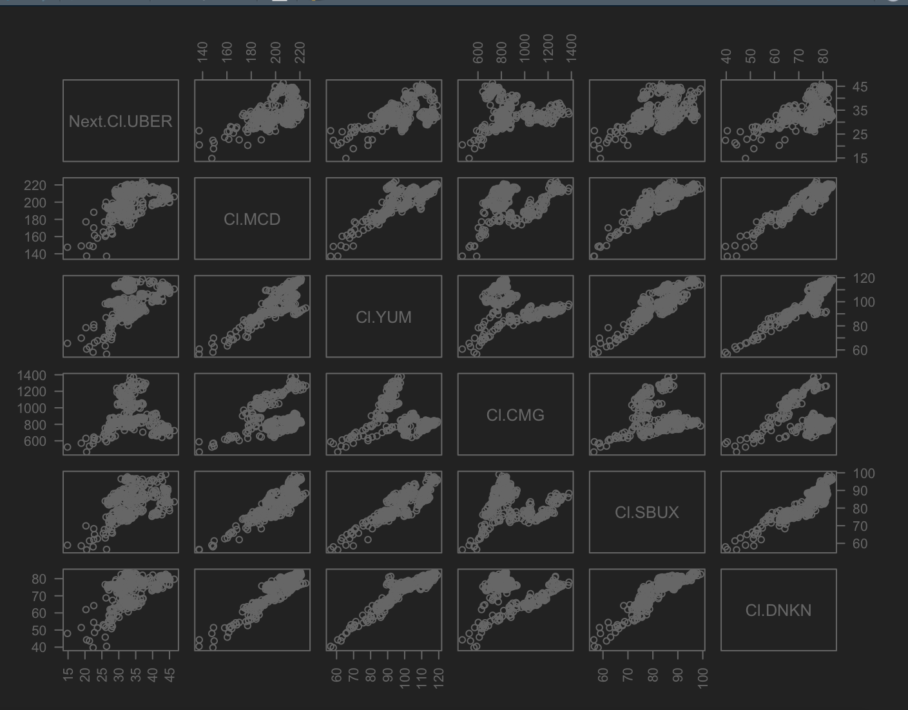
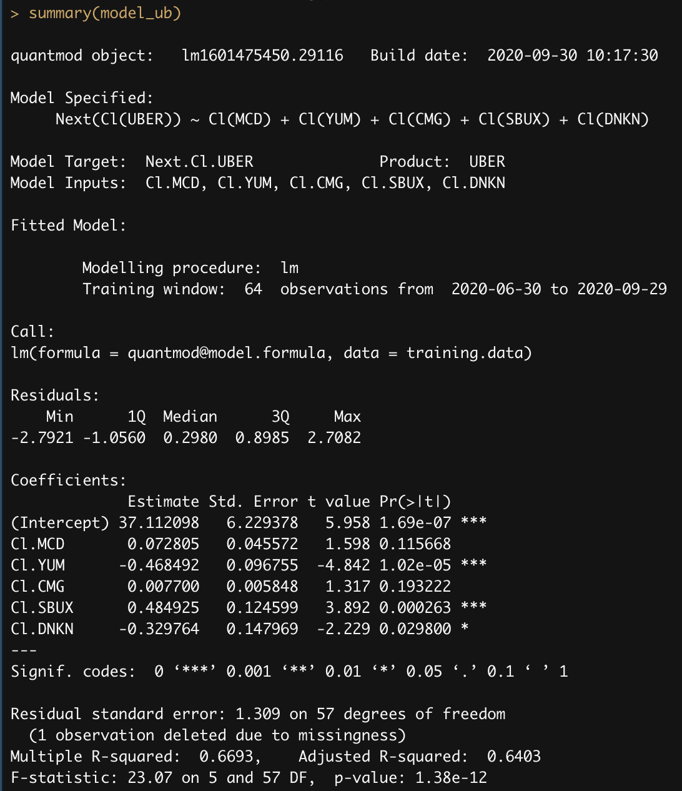

# Project Two, Part Two: Intro to Data Science - Using the Stock Market to Describe, Analyze and Predict
For this projects, I wanted to look at how the worth fast food companies can impact a delivery company, like UberEats. So, I selected UBER to be my predicted stock and my predictive stocks as MCD, YUM, CMG, SBUX, and DNKN. These are Uber, McDonald's, Yum!Brands (parent company to Taco Bell, KFC, & Pizza Hut), Chipotle, 
#Starbucks, Dunkin' Donuts respectively.  

## Deliverable One
The following plot shows the relationship of the UBER stock value with each of the predictor stocks on the previous date. Note that the trend can be essentially generalized to a positive linear correlation in every case.  
 

## Deliverable Two
This is the output summary of the statistical model where UBER is the predicted stock and MCD, YUM, CMG, SBUX, and DNKN are the predictive stocks. This model has an adjusted r-squared value of 0.6403, meaning the model is accurate ~64.03% of the time. 
 

