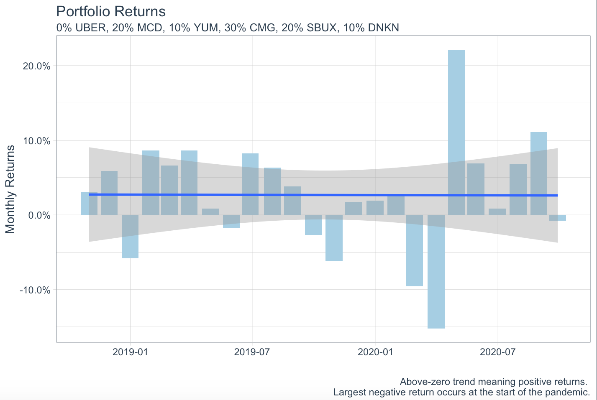
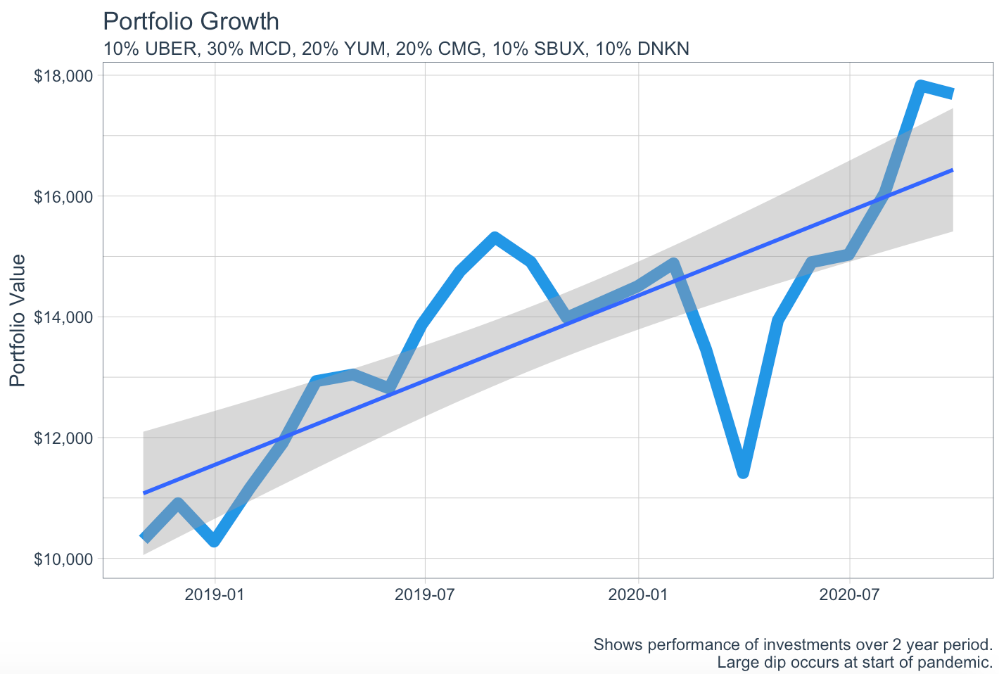

# Project Two, Part Three: Intro to Data Science - Using tidyquant Analyze Stock Performance
For this component, I used the same stocks from part two (UBER, MCD, YUM, CMG, SBUX, and DNKN), and tried to make a profit off of a $10,000 investment. I allocated the investment based on how well a particular stock performed (specific percentages described on the plots). One thing to note is the impact of COVID-19 on the stocks. There is a pretty large decline in value around March, when we started seeing the virus's impact on the economy. However, the value increases fairly rapidly in the following months. Demand for fast food and delivery went up with the pandemic, so it makes sense that these stocks saw an upward trend following the initial dip. 

## Deliverable One
The horizontal line shows that the average return is ~3% each month.  
 

## Deliverable Two
The thin line has a positive slope, meaning the value of the portfolio increased over time.
 
