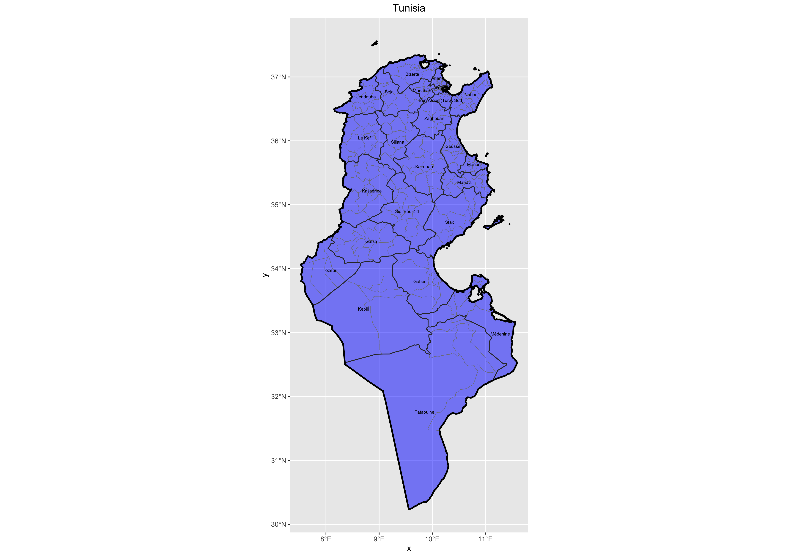

# Project Three, Part One: Projecting, Plotting and Labelling Administrative Subdivisions: Team Challenge Question
The following plot shows the North African nation of Tunisia. There are three subdivisions on the following map: the international border (adm 0), the 24 governate borders (adm 1), and the 264 delegation/district borders (adm 2). Tunisia has a population of roughly 11.5 million people.

## Team Challenge Question
 
