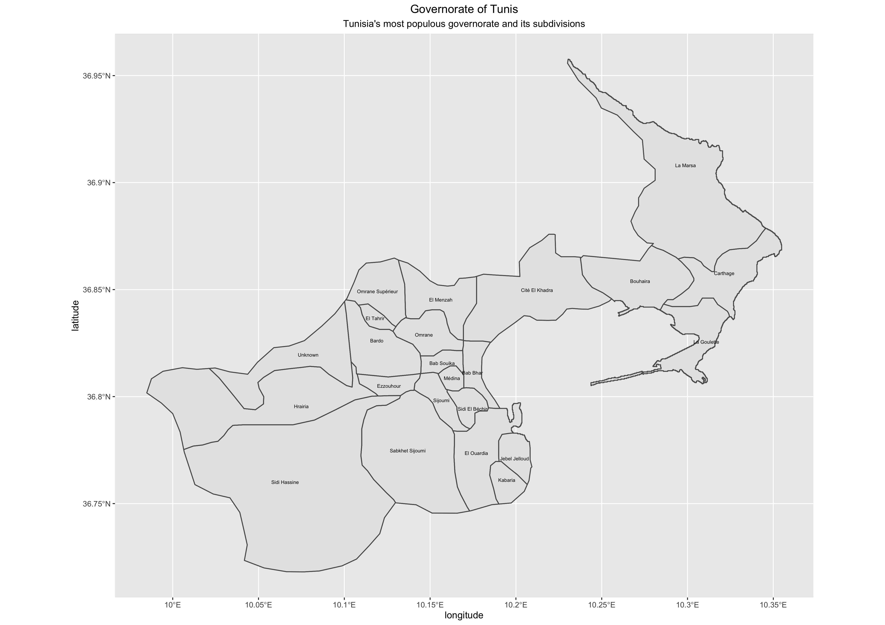
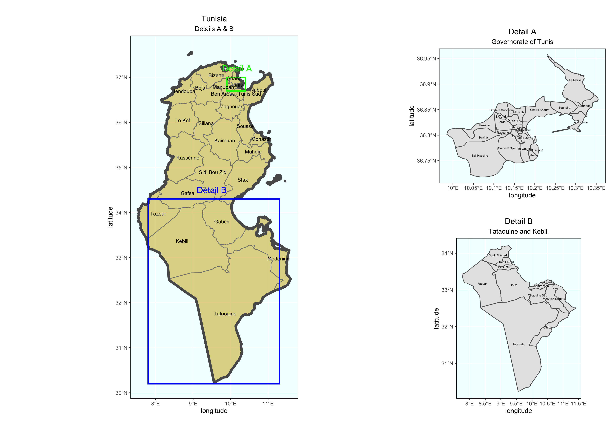

# Project Three, Part Two: Projecting, Plotting and Labelling Administrative Subdivisions: Stretch Goals 2 & 3

## Stretch Goal 2
This map shows Tunis, the most populous governate of Tunisia and its 22 districts.
 

## Stretch Goal 3
This map shows Tunisia on the left. On the right hand side we see a closer view of Tunis, the most populous region, and two of the southern governates, Tataouine and Kebili, which have lower population densities than Tunis.
 
