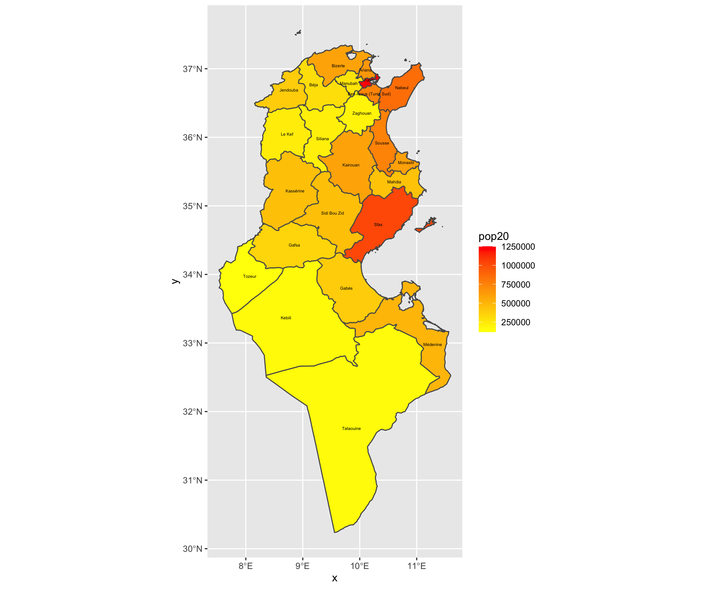
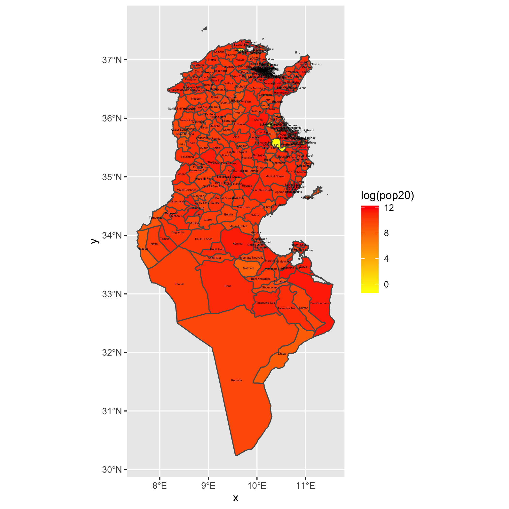
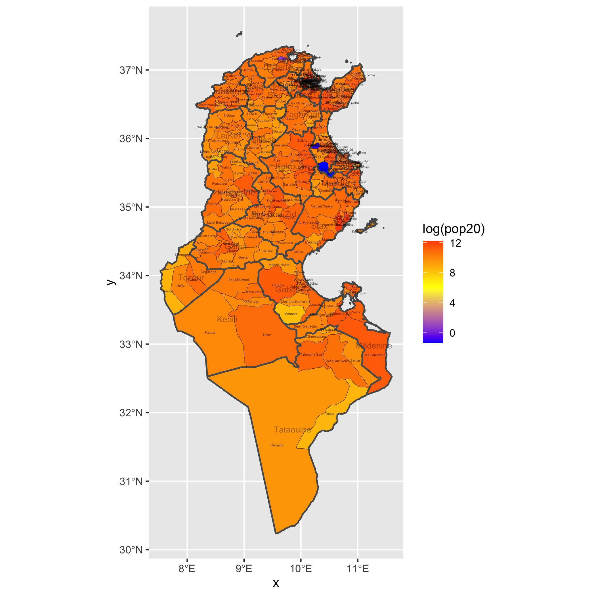
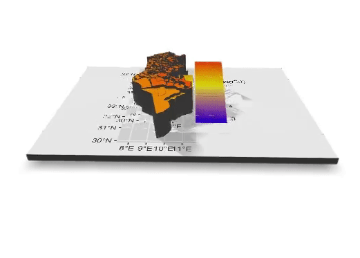

# Project Four, Part One: Extracting Populations from a Raster and Aggregating to each Unit: Team Challenge Question and  Stretch Goals 1-3

## Team Challenge Question
This map shows Tunisia, divided by governate. The darker the fill color of each governate, the higher the population.
 

## Stretch Goal 1
This map shows Tunisia, now divided by delegation/district. The darker the fill color of each of these delegations, the higher the log(population).
 

## Stretch Goal 2
This map of Tunisia is something of a combination of the above two. The governates are bordered by thicker lines than the delegation, and the fill color is allocated to the delegations by the log of the population value.
 

## Stretch Goal 3
This gif is a three dimensional represention of the map from stretch goal two.
 
