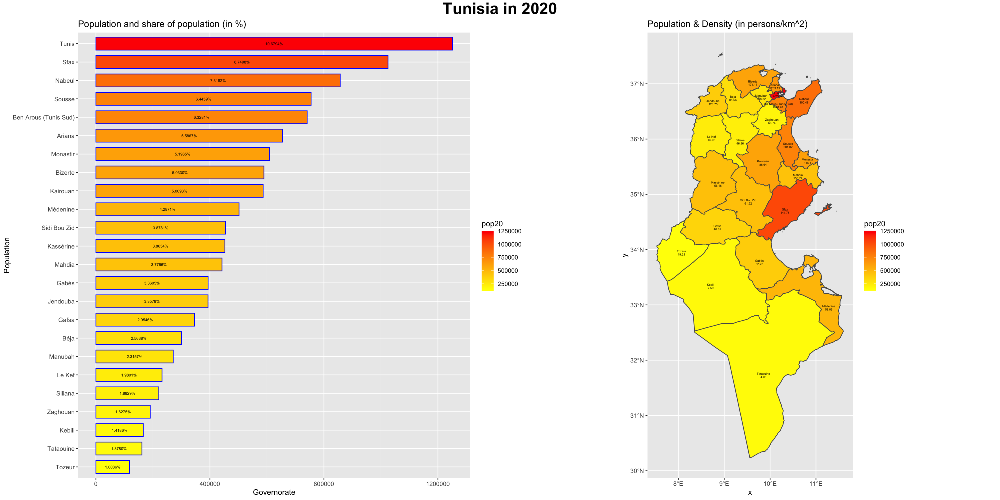
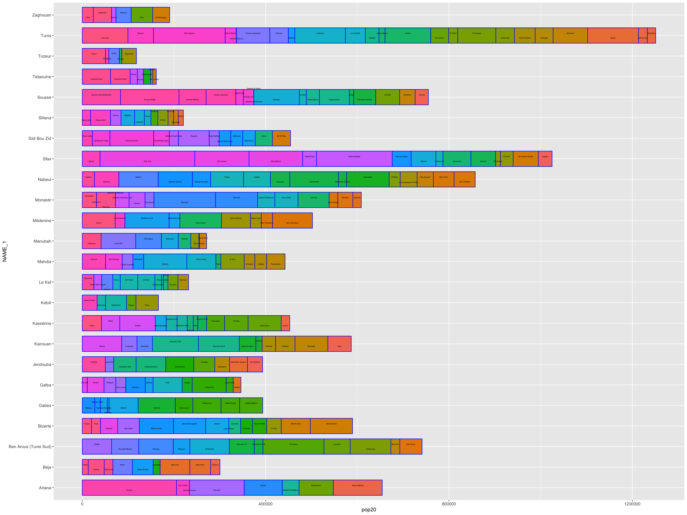

# Project Four, Part Two: Creating a Geometric Bar Plot with your Simple Feature object: Individual Deliverable and Stretch Goals 1-2

## Individual Deliverable
On the right side of this figure is the map from part 1, team challenge question, with population density alongside the names of each governate. The bar plot on the left shows the population of each governate, as well as what percentage of the nation's total population it makes up.
 

## Stretch Goal 1
This barplot again shows each each governate by population. However, each individual bar is divided into its delegations, thereby showing the populations of each governate and the relative populations of their respective delegations
 

## Stretch Goal 2
This is simply the corresponding video to the gif in part 1, stretch goal 3.
[Link To Video](tunisia.mp4) 
